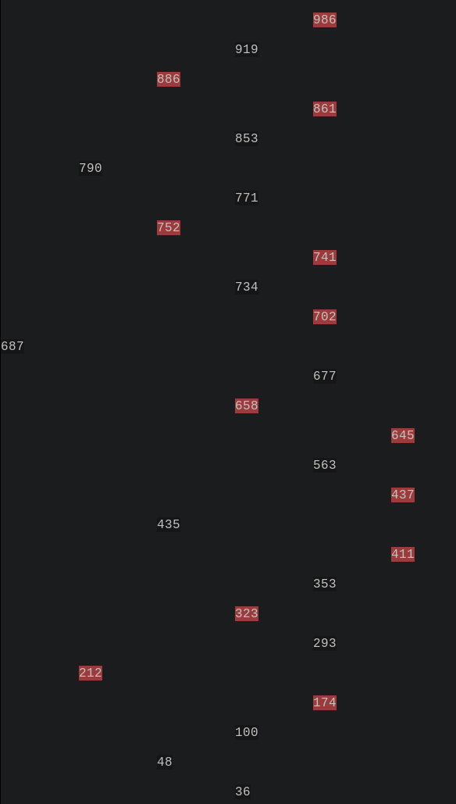
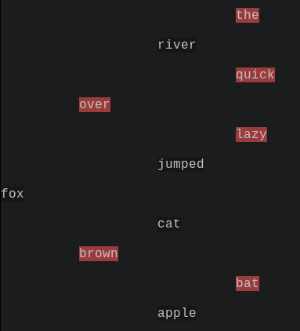

# Red-Black Tree Implementation and Performance Analysis

## Project Overview

This project is a custom C++ implementation of a **Red-Black Tree (RBT)**, a self-balancing Binary Search Tree. The goal was to implement a structure that guarantees $O(\log n)$ time complexity for search, insertion, and deletion operations by strictly maintaining five core RBT properties.

## Features

-   **Core Operations:** Insertion, Deletion, Search, and a colorful visualization in the terminal using ANSI color codes.
-   **Balancing:** Automated rebalancing using Left/Right rotations and recoloring.
-   **Memory Management:** Efficient cleanup using a recursive destructor to prevent memory leaks.
-   **Performance Driver:** Built-in benchmarking using `<chrono>` for high-precision timing.
-   **Templating:** Works for any type. You can make a Red-Black Tree for strings as well.

### Tree printed out (from left to right, with red and black nodes color coded)



### Example of Red-Black Tree using strings



## How to run

### Prerequisites

-   A C++ compiler (GCC/Clang)
-   C++20 or higher
-   Make

### Compilation

```bash
make # to compile
make run # to run
make test # to run tests
```

### Benchmark

To run benchmarks, swap out `main.cpp` for `bench.cpp` in the Makefile.

Here are the results:

#### Performance Analysis: Red-Black Tree

| Size    | Total Insert (μs) | Avg Search (μs/operation) |
| :------ | :---------------- | :------------------------ |
| 1,000   | 365               | 0.081                     |
| 10,000  | 6,588             | 0.105                     |
| 50,000  | 24,440            | 0.118                     |
| 100,000 | 42,647            | 0.113                     |
| 500,000 | 303,209           | 0.135                     |

**Model Fit & Regression:**

-   **Coefficient of Determination ($R^2$):** $0.9116$
-   **Regression Formula:**
    $$\text{Avg Search } (\mu s) = 0.0243383 + 0.0185869 \cdot \ln(\text{Size})$$
